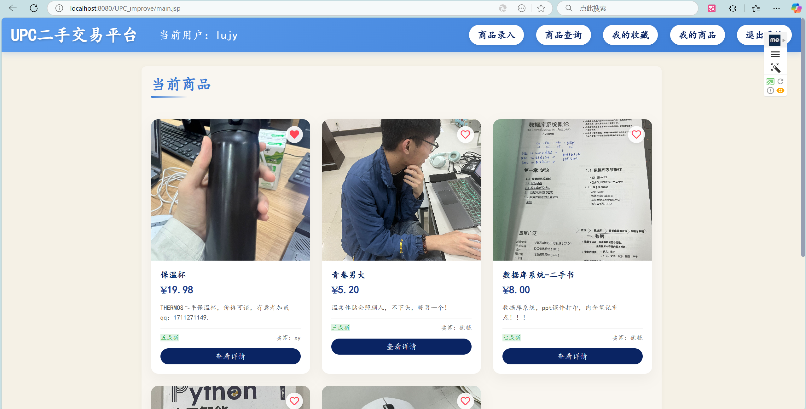
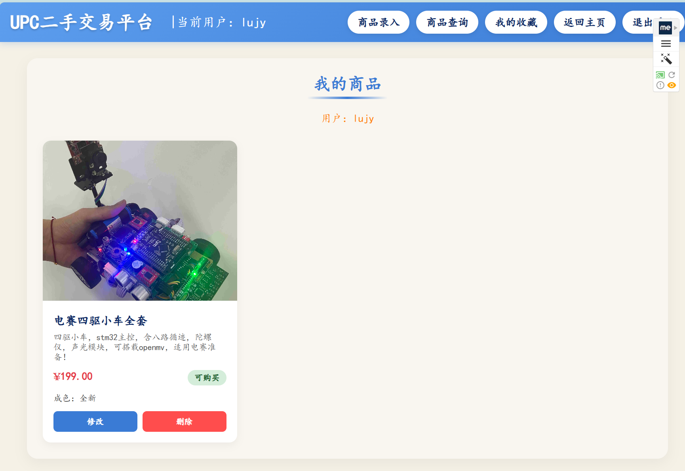

# 校园二手交易平台


> 基于Java Web的校园二手交易解决方案，为大学生提供安全便捷的二手物品交易环境。

## ✨ 功能特点

- 💼 **用户系统** - 注册登录、权限分级(普通用户/管理员)
- 🛍️ **商品管理** - 发布、修改、删除、查询商品
- 💖 **收藏功能** - 一键收藏感兴趣商品，快速访问
- 💬 **留言互动** - 商品留言咨询，促进用户交流
- 🔍 **高级搜索** - 多维度商品搜索与筛选
- 📱 **响应式设计** - 适配多种设备，良好的移动端体验

## 📸 界面展示

### 登录界面


### 主界面


### 我的商品


### 商品详情


## 🚀 快速开始

### 环境要求

| 组件 | 要求 |
|------|------|
| JDK | 8+ |
| Tomcat | 8+ |
| MySQL | 5.7+ |
| 操作系统 | Windows/macOS/Linux |
| 浏览器 | Chrome/Firefox/Safari/Edge (最新版) |

### 部署步骤

1. **克隆仓库**
   ```bash
   git clone https://github.com/yourusername/second-hand-trading.git
   ```

2. **配置数据库**
   - 通过sqlBean更新数据库连接参数(URL、用户名、密码)
   - 运行SQL脚本创建所需数据表

3. **部署项目**
   - 配置并启动Tomcat服务器
   - 部署项目至Tomcat

4. **访问系统**
   - 本地访问: `http://localhost:8080/UPC_improve/login.jsp`
   - 远程访问: `http://[服务器IP]:8080/UPC_improve/login.jsp`

### 预设账户

| 角色 | 用户名 | 密码 |
|------|------|------|
| 管理员 | 徐银 | 123456 |
| 测试用户 | lujy | 123456 |

## 📁 项目结构

```
UPC_improve/
├── src/
│   └── MyBean/
│       ├── conClass.java   # 中文转换
│       └── sqlBean.java    # 数据库连接
│
├── WebRoot/
│   ├── images/             # 图片资源
│   ├── WEB-INF/            # Web配置  
│   ├── login.jsp           # 登录界面
│   ├── main.jsp            # 主界面
│   ├── itemdetail.jsp      # 商品详情
│   ├── infolr.jsp          # 商品录入
│   ├── infocx.jsp          # 商品查询
│   ├── mycollection.jsp    # 我的收藏
│   ├── myitems.jsp         # 我的商品
│   ├── error.jsp           # 错误页面
│   └── exit.jsp            # 退出页面
```

## 💾 数据模型

| 表名 | 描述 | 主要字段 |
|------|------|---------|
| Users | 用户信息 | 用户名、密码、联系方式、邮箱、用户类型 |
| Items | 商品信息 | 名称、描述、价格、成色、状态、图片路径 |
| Messages | 留言信息 | 商品ID、发送者ID、内容、时间 |
| Collections | 收藏记录 | 用户ID、商品ID、收藏时间 |

## 💡 功能亮点

- **用户体验** - 直观界面、表单验证、即时反馈
- **安全机制** - 密码加密、输入验证、权限控制
- **实用功能** - 多条件搜索、状态管理、互动系统

## 🔮 未来计划

- [ ] 集成在线支付功能
- [ ] 用户评价与信誉系统
- [ ] 移动端App开发
- [ ] 消息推送通知
- [ ] 智能商品推荐算法

## ❓ 常见问题

<details>
<summary><b>图片上传失败</b></summary>
- 确保uploads目录具有正确的写入权限
- 检查配置的上传文件大小限制
</details>

<details>
<summary><b>数据库连接错误</b></summary>
- 验证数据库连接参数是否正确
- 确认MySQL服务是否正常运行
</details>

## 🤝 参与贡献

1. Fork本仓库
2. 创建特性分支 (`git checkout -b feature/AmazingFeature`)
3. 提交更改 (`git commit -m 'Add some AmazingFeature'`)
4. 推送分支 (`git push origin feature/AmazingFeature`)
5. 提交Pull Request

## 📞 联系方式

项目维护者 - [xy-lo](https://github.com/xy-lo)
